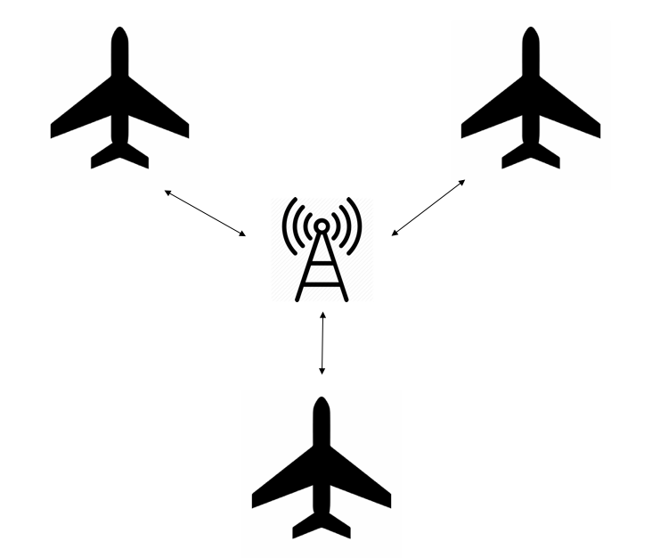

## Mediator Pattern

### Note
The mediator pattern is a behavioral design pattern that encapsulates how objects communicate with one another. 



The airplanes are the objects that want to communicate with each other.

### Mediator Protocol
The mediator protocol defines methods and properties that the mediator must
implement.
``` swift
protocol Mediator {
    func send(message: String, sender: Airplane)
}
``` 

### Implement Mediator
The TowerMediator is the object that controls the communication of the airplanes. It implements the mediator protocol.
```swift 
class TowerMediator: Mediator {
    var airplanes: [Airplane] = []
    func register(airplane: Airplane) {
        airplanes.append(airplane)
    }
    func send(message: String, sender: Airplane) {
        for airplane in airplanes {
            if airplane.id != sender.id {
                airplane.receive(message: message)
            }
        }
    }
}
``` 

### Airplane Protocol
The Airplane protocol defines methods and properties that each colleague must implement.
```swift
protocol Airplane {
    var id: String { get }
    func send(message: String)
    func receive(message: String)
}
```

### Implement Airplane
```swift
class Emirates: Airplane {
    var id: String
    var mediator: TowerMediator

    init(mediator: TowerMediator) {
        self.id = "Emirates"
        self.mediator = mediator
    }
    func send(message: String) {
        mediator.send(message: message, sender: self)
    }
    func receive(message: String) {
        print("Emirates received: " + message)
    }
}

class China_Airline: Airplane {
    var id: String
    var mediator: TowerMediator

    init(mediator: TowerMediator) {
        self.id = "China_Airline"
        self.mediator = mediator
    }
    func send(message: String) {
        mediator.send(message: message, sender: self)
    }
    func receive(message: String) {
        print("China_Airline received: " + message)
    }
}

class EVA_Air: Airplane {
    var id: String
    var mediator: TowerMediator

    init(mediator: TowerMediator) {
        self.id = "EVA_Air"
        self.mediator = mediator
    }
    func send(message: String) {
        mediator.send(message: message, sender: self)
    }
    func receive(message: String) {
        print("EVA_Air received: " + message)
    }
}
``` 

### Usage
#### Quick Start
```swift
// 1
let mediator = TowerMediator()

// 2 
let emirates = Emirates(mediator: mediator)
let chinaAir = China_Airline(mediator: mediator)
let evaAir = EVA_Air(mediator: mediator)

// 3 
mediator.register(airplane: emirates)
mediator.register(airplane: chinaAir)
mediator.register(airplane: evaAir)

// 4
mediator.send(message: "Mayday", sender: emirates)


/* 5
  China_Airline received: Mayday
  EVA_Air received: Mayday
*/

```   
 1. To initialize TowerMediator.
 2. To Create three airplane with mediator: Emirates、China_Airline、EVA_Air.
 3. The mediator to register airplane.
 4. The Emirates send "Mayday" meassage by tower.
 5. The "Mayday" message sent by Emirates was received by China_Airline and EVA_Air, and Emirates did not receive it.
 
